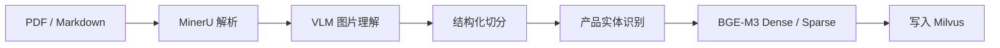
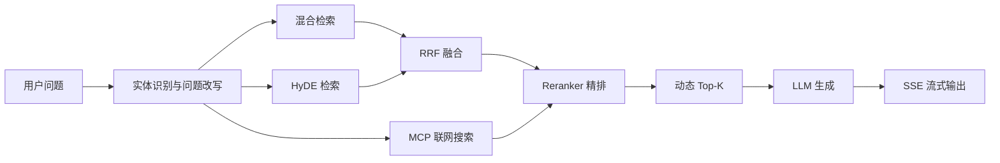

# 掌柜智库（Knowledge Base）

面向企业私有资料的 RAG 知识库应用。系统将产品资料、维修手册和使用指南加工为可检索知识，并通过混合召回、重排和大模型生成，为技术人员、销售人员及客户提供可溯源的问答服务。

> 本仓库只包含应用代码，不包含企业私有文档、模型权重、真实凭据或运行时数据库。

## 核心能力

- PDF 与 Markdown 文档导入
- MinerU PDF 结构化解析
- 视觉模型生成图片摘要，原图保存至 MinIO
- 基于 Markdown 标题、长度和重叠窗口的文档切分
- BGE-M3 Dense/Sparse 双向量生成
- Milvus 混合向量检索
- 对话历史驱动的产品实体识别与问题改写
- 普通混合检索、HyDE 和联网搜索多路召回
- 加权 RRF 融合与 Cross-Encoder 重排
- LangGraph 工作流编排
- FastAPI、SSE 流式回答与 MongoDB 会话历史
- Langfuse 可观测性基础设施

## 工作流程

### 文档导入



### 知识查询



详细节点说明参见[项目工作流程图](./项目工作流程图.md)。

## 技术栈

- Python 3.11+
- FastAPI / Uvicorn
- LangChain / LangGraph
- BGE-M3 / DashScope
- Milvus / MinIO / MongoDB
- Langfuse / PostgreSQL
- Docker Compose / uv

## 快速开始

### 1. 克隆仓库

```powershell
git clone https://github.com/yangronglai01-art/knowledge_base.git
cd knowledge_base
```

### 2. 准备配置

```powershell
Copy-Item .env.example .env
```

编辑 `.env`，填写 MinerU、模型服务、MinIO 和 Langfuse 的真实配置。不要提交 `.env`。

### 3. 启动基础服务

```powershell
docker compose up -d
```

默认启动 Milvus、MinIO、Attu、MongoDB、Langfuse 和 PostgreSQL。首次运行前请将 `.env` 中所有 `replace_with_...` 占位值替换为安全值。

### 4. 安装 Python 依赖

```powershell
.\setup.ps1
```

也可以在已经安装 `uv` 的环境中执行：

```powershell
uv sync
```

当前依赖锁定配置面向 CUDA 12.8；模型设备由 `.env` 中的 `BGE_DEVICE` 和 `BGE_FP16` 控制。

### 5. 启动应用

文档导入服务：

```powershell
uv run uvicorn knowledge_base.web.api.import_service:app --host 0.0.0.0 --port 8000
```

知识查询服务：

```powershell
uv run uvicorn knowledge_base.web.api.query_service:app --host 0.0.0.0 --port 8001
```

启动后可访问：

- 导入页面：`http://localhost:8000/import.html`
- 导入接口文档：`http://localhost:8000/docs`
- 对话页面：`http://localhost:8001/chat.html`
- 查询接口文档：`http://localhost:8001/docs`
- Attu：`http://localhost:7000`
- MinIO Console：`http://localhost:9001`
- Langfuse：`http://localhost:3000`

## 主要 API

| 服务 | 方法 | 路径 | 说明 |
|---|---|---|---|
| 导入 | `POST` | `/upload` | 上传 PDF 或 Markdown 并启动导入任务 |
| 导入 | `GET` | `/status/{task_id}` | 查询导入进度 |
| 查询 | `POST` | `/query` | 提交知识库问题 |
| 查询 | `GET` | `/stream/{task_id}` | 通过 SSE 获取增量结果 |
| 查询 | `GET` | `/history/{session_id}` | 获取会话历史 |
| 查询 | `DELETE` | `/history/{session_id}` | 清空会话历史 |
| 查询 | `GET` | `/health` | 健康检查 |

## 目录结构

```text
knowledge_base/
├── knowledge_base/          # 核心应用包
│   ├── config/              # 环境配置
│   ├── import_process/      # 文档导入工作流
│   ├── query_process/       # 检索与回答工作流
│   ├── tool/                # 日志与模型工具
│   ├── utils/               # Milvus、MinIO、MongoDB 等工具
│   └── web/                 # FastAPI 接口与页面
├── examples/                # FastAPI、SSE 与检索示例
├── scripts/
│   ├── diagnostics/         # 只读检查与诊断脚本
│   └── maintenance/         # 具有写入或删除副作用的维护脚本
├── tests/                   # 自动化测试目录
├── docker-compose.yml
├── pyproject.toml
└── .env.example
```

## 安全说明

- `.env`、IDE 配置、虚拟环境、运行数据和日志已通过 `.gitignore` 排除。
- `scripts/maintenance` 中的脚本可能修改或删除数据，执行前请确认目标环境。
- 当前 CORS 配置用于本地开发；生产部署应限制允许的来源，并在外层增加身份认证和访问控制。
- 生产环境应更换所有默认账号和占位密钥，并通过密钥管理服务注入凭据。

## 当前状态

本仓库为项目展示与持续完善版本。`tests` 已预留单元测试和集成测试目录，后续应补充检索评测、节点测试和接口回归测试。
