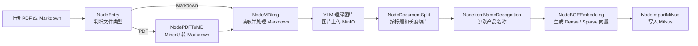
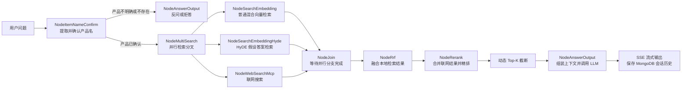

# Zhixi 项目工作流程图

本文档概括项目当前的两条核心业务链路：文档导入流程与知识查询流程。

## 1. 文档导入流程

文档导入工作流由 `knowledge_base/import_process/main_graph2.py` 组织，负责把 PDF 或 Markdown 文档加工成可检索的知识库数据。



### 节点说明

| 节点 | 主要作用 | 主要产出 |
|---|---|---|
| `NodeEntry` | 校验输入路径，识别 PDF 或 Markdown | 文件类型、标题、文件路径 |
| `NodePDFToMD` | 调用 MinerU 解析 PDF，下载并解压结果 | Markdown 文件及图片目录 |
| `NodeMDImg` | 使用视觉模型生成图片摘要，并将图片上传 MinIO | 带图片说明和远程地址的 Markdown |
| `NodeDocumentSplit` | 按 Markdown 标题粗切，再对过长或过短内容细化 | 文档 Chunk 列表 |
| `NodeItemNameRecognition` | 根据文件名和正文识别品牌、型号和产品名称 | 标准化产品名称 |
| `NodeBGEEmbedding` | 使用 BGE-M3 生成稠密向量与稀疏向量 | 带向量的 Chunk 列表 |
| `NodeImportMilvus` | 创建集合、清理同文件旧数据并批量插入 | Milvus 中的产品与文档数据 |

### 主要存储位置

- MinIO：保存原始 PDF 和文档图片。
- Milvus 产品名称集合：用于查询阶段的产品确认。
- Milvus 文档切片集合：用于正文内容的混合向量检索。
- 本地任务目录：保存 MinerU 结果、加工后的 Markdown 和 Chunk 备份。

## 2. 知识查询流程

查询工作流由 `knowledge_base/query_process/main_graph.py` 组织，负责理解用户问题、检索资料、重排候选内容并生成流式回答。



### 节点说明

| 节点 | 主要作用 | 主要产出 |
|---|---|---|
| `NodeItemNameConfirm` | 结合历史对话提取产品名、改写问题，并在产品集合中进行名称对齐 | 产品名、改写问题，或澄清回答 |
| `NodeMultiSearch` | 将查询分发到三条检索路径 | 不修改状态，只负责流程分叉 |
| `NodeSearchEmbedding` | 对改写问题生成 Dense / Sparse 向量并搜索本地知识库 | 普通混合检索结果 |
| `NodeSearchEmbeddingHyde` | 先生成假设性答案，再使用“问题＋假设答案”检索 | HyDE 检索结果 |
| `NodeWebSearchMcp` | 通过 MCP 调用外部搜索服务 | 网页标题、摘要和 URL |
| `NodeJoin` | 等待三条并行检索路径结束 | 合并后的 LangGraph 状态 |
| `NodeRrf` | 使用加权倒数排名融合普通检索和 HyDE 检索 | 本地候选 Chunk |
| `NodeRerank` | 合并本地与联网资料，使用 Cross-Encoder 精排并动态截断 | 最终参考文档 |
| `NodeAnswerOutput` | 拼接文档、历史和产品信息，流式调用 LLM | 最终答案、图片地址和会话记录 |

## 3. 查询阶段的数据流向

```text
用户问题
  -> 产品实体与独立问题
  -> 多路候选资料
  -> RRF 初排
  -> Cross-Encoder 精排
  -> 最终上下文
  -> LLM 回答
  -> SSE 推送前端
```

其中，MongoDB保存会话历史，Milvus负责本地知识检索，MinIO提供文档图片，任务状态和SSE队列负责向前端展示处理进度与增量答案。
